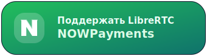
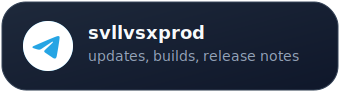
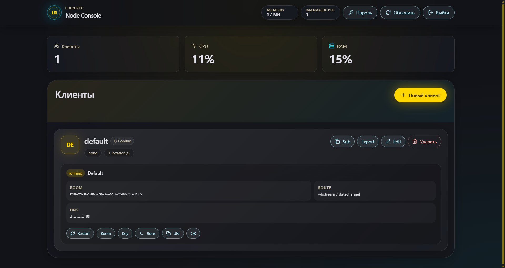

<h1 align="center">LibreRTC Node</h1>

<p align="center">
  Серверный node для LibreRTC: веб-панель, подписки для клиентов, генерация room/key, запуск и supervision <code>olcrtc</code> runtime-инстансов, квоты и диагностика. Поддерживает быстрый deploy на чистый VPS через интерактивный setup wizard с Docker и Caddy.
</p>

<p align="center">
  
  
  
  
</p>

<p align="center">
  <a href="#скриншот">Скриншот</a> ·
  <a href="#поддержка-и-сообщество">Поддержка</a> ·
  <a href="#что-это">Что это</a> ·
  <a href="#быстрый-деплой">Быстрый деплой</a> ·
  <a href="#возможности">Возможности</a> ·
  <a href="#api">API</a> ·
  <a href="#безопасность">Безопасность</a>
</p>

<table align="center">
  <tr>
    <td align="center" width="760">
      <h3>Поддержка и сообщество</h3>
      <p>Поддержать разработку, следить за обновлениями или присоединиться к обсуждению LibreRTC.</p>
      <table align="center">
        <tr>
          <td align="center" width="350"><a href="https://t.me/tribute/app?startapp=dK9j"></a></td>
          <td align="center" width="350"><a href="https://nowpayments.io/donation/svllvsx"></a></td>
        </tr>
        <tr>
          <td align="center" width="350"><a href="https://t.me/svllvsxprod"></a></td>
          <td align="center" width="350"><a href="https://t.me/openlibrecommunity"></a></td>
        </tr>
      </table>
    </td>
  </tr>
</table>

## Скриншот

<p align="center">
  
</p>

## Что это

LibreRTC Node управляет серверной частью LibreRTC deployment. Он хранит конфигурацию клиентов, создаёт subscription URL, показывает QR/URI payload, запускает отдельные `olcrtc` процессы для каждой location и следит за их состоянием.

Node нужен там, где хочется развернуть LibreRTC на VPS без ручной сборки runtime, настройки Docker Compose, reverse proxy и временных admin credentials. Installer использует готовый Docker image из GHCR, поэтому VPS не тратит ресурсы на сборку Go/core. На первом запуске installer генерирует временный login/password и заставляет сменить их при первом входе.

Основной сценарий:

1. Администратор запускает installer на чистом сервере.
2. Wizard спрашивает режим публикации: домен через Caddy или raw port.
3. Installer ставит зависимости, собирает `olcrtc`, создаёт config и временные credentials.
4. Панель открывается по `/admin`.
5. Администратор создаёт клиентов и выдаёт им subscription URL или `olcrtc://` URI.

## Быстрый деплой

На чистом Ubuntu/Debian сервере:

```sh
curl -fsSL https://raw.githubusercontent.com/svllvsxprod/librertc-node/main/deploy/docker/install.sh | sudo sh
```

Installer запустит интерактивный wizard:

```text
LibreRTC Node setup

Choose how the admin panel should be published:
  1) Domain with Caddy and HTTPS
  2) Raw public port
Mode [1]:
Domain []:
Internal panel port [18888]:
```

Для domain mode укажи домен, например:

```text
Domain []: rtc.example.com
```

После успешного запуска installer выведет:

```text
LibreRTC Node deployed.
URL: https://rtc.example.com/admin

============================================================
TEMPORARY ADMIN CREDENTIALS - SAVE THESE NOW
============================================================
Admin panel: https://rtc.example.com/admin
Login:       ...
Password:    ...

These credentials are required for the first login.
They are stored on the VPS in: /opt/librertc-node/deploy/docker/local/panel.env

The first login will require changing both login and password.
============================================================
```

Первый вход потребует сменить и login, и password.

Если временные login/password потерялись до первого входа, их можно посмотреть на VPS:

```sh
sudo cat /opt/librertc-node/deploy/docker/local/panel.env
```

Файл содержит `OLCRTC_MANAGER_USER` и `OLCRTC_MANAGER_PASS`. После первого входа замени оба значения через setup-экран в панели.

Для автоматизации можно передать параметры напрямую:

```sh
curl -fsSL https://raw.githubusercontent.com/svllvsxprod/librertc-node/main/deploy/docker/install.sh | sudo sh -s -- deploy --mode domain --domain rtc.example.com
```

Raw port mode:

```sh
curl -fsSL https://raw.githubusercontent.com/svllvsxprod/librertc-node/main/deploy/docker/install.sh | sudo sh -s -- deploy --mode port --port 18888
```

## Возможности

- Веб-панель администратора на `/admin`.
- Temporary login/password на первом deploy.
- Forced first-login setup со сменой login и password.
- Готовый Docker image с bundled `olcrtc` runtime.
- Автоматический Docker Compose deploy.
- Domain mode через Caddy с HTTPS.
- Raw port mode для тестов и закрытых окружений.
- Управление клиентами, квотами и locations.
- Генерация room id через актуальный `olcrtc` runtime.
- Subscription URL и `olcrtc://` URI для клиентов.
- Runtime supervision и restart actions.
- Health, diagnostics, metrics и audit events.

## Как это работает

```text
Admin browser
  -> Caddy HTTPS reverse proxy
  -> LibreRTC Node manager
  -> config.json + panel.env
  -> supervised olcrtc server processes
  -> WebRTC carrier rooms
  -> LibreRTC Client subscriptions
```

В domain mode контейнер слушает только `127.0.0.1:18888`, а Caddy публикует HTTPS-домен. В port mode контейнер слушает публичный host port напрямую.

## Проверка

После deploy:

```sh
docker ps
```

```sh
curl -fsS http://127.0.0.1:18888/api/v1/health
```

Для domain mode:

```sh
systemctl status caddy --no-pager
caddy validate --config /etc/caddy/Caddyfile
curl -fsS https://rtc.example.com/api/v1/health
```

Логи:

```sh
docker logs --tail 100 librertc-node
journalctl -u caddy -n 100 --no-pager
```

## Локальная сборка

Frontend assets:

```sh
pnpm install
pnpm build
```

Manager binary:

```sh
CGO_ENABLED=0 GOOS=linux GOARCH=amd64 go build -o librertc-node ./cmd/olcrtc-manager
```

Tests:

```sh
go test ./...
```

## Docker

Docker deployment files are in `deploy/docker`.

По умолчанию используется image:

```text
ghcr.io/svllvsxprod/librertc-node:latest
```

Обновление image не перетирает данные панели: `config.json` и `panel.env` лежат в persistent bind mount `deploy/docker/local` на сервере, а не внутри контейнера.

Useful commands from repo checkout:

```sh
sh deploy/docker/install.sh check
sh deploy/docker/install.sh start
sh deploy/docker/install.sh status
sh deploy/docker/install.sh logs
sh deploy/docker/install.sh health
sh deploy/docker/install.sh stop
```

Локальная сборка image, если нужна разработка без GHCR:

```sh
sh deploy/docker/install.sh build-image
```

Default paths on server:

```text
/opt/librertc-node
/opt/librertc-node/deploy/docker/local/config.json
/opt/librertc-node/deploy/docker/local/panel.env
/etc/caddy/conf.d/librertc-node.caddy
```

## API

Public health endpoint:

```text
GET /api/v1/health
```

Admin API includes:

```text
GET    /api/v1/server/info
GET    /api/v1/diagnostics
POST   /api/v1/reload
GET    /api/v1/clients
POST   /api/v1/clients
GET    /api/v1/clients/{client_id}
PATCH  /api/v1/clients/{client_id}
PUT    /api/v1/clients/{client_id}
DELETE /api/v1/clients/{client_id}
GET    /api/v1/clients/{client_id}/subscription
GET    /api/v1/clients/{client_id}/qr
```

Responses use a stable envelope:

```json
{
  "ok": true,
  "data": {}
}
```

Errors:

```json
{
  "ok": false,
  "error": {
    "code": "ERROR_CODE",
    "message": "Human-readable message",
    "details": {}
  }
}
```

## Конфигурация

Minimal `config.json` shape:

```json
{
  "version": 1,
  "name": "LibreRTC Node",
  "port": 8888,
  "clients": [
    {
      "client-id": "default",
      "quota": {
        "speed_mbps": 0,
        "traffic_gb": 0
      },
      "locations": [
        {
          "name": "Default",
          "endpoint": {
            "room_id": "concrete-room-id",
            "key": "64-hex-character-key"
          },
          "carrier": "wbstream",
          "transport": {
            "type": "datachannel"
          },
          "link": "direct",
          "data": "data",
          "dns": "1.1.1.1:53"
        }
      ]
    }
  ]
}
```

Installer генерирует concrete `room_id` и `key` автоматически. Placeholder values rejected by deployment preflight checks.

## Безопасность

- Live `olcrtc://` URI, room IDs, keys и temporary passwords не должны коммититься.
- `panel.env` создаётся на сервере и не хранится в репозитории.
- First deploy credentials временные и требуют смены при первом входе.
- В domain mode manager bind остаётся на `127.0.0.1`, внешний доступ идёт через Caddy.
- Raw port mode предназначен для тестов, закрытых окружений или ручной firewall настройки.
- Runtime key values в логах manager редактируются как `<redacted>`.

## Структура

```text
cmd/olcrtc-manager/       Go manager, admin API and embedded web UI
src/                      React/Vite admin panel source
cmd/olcrtc-manager/web/   Built frontend assets embedded by Go
deploy/docker/            Docker Compose, installer and core build scripts
docs/                     Plans and operational notes
screens/                  README screenshots
```

## Теги

`librertc` `vpn-server` `webrtc` `go` `react` `vite` `docker` `caddy` `reverse-proxy` `admin-panel` `self-hosted` `olcrtc`

## Лицензия

MIT

## Примечание

Этот репозиторий содержит server node и admin panel. Windows client и core runtime ведутся отдельно в рамках LibreRTC.
